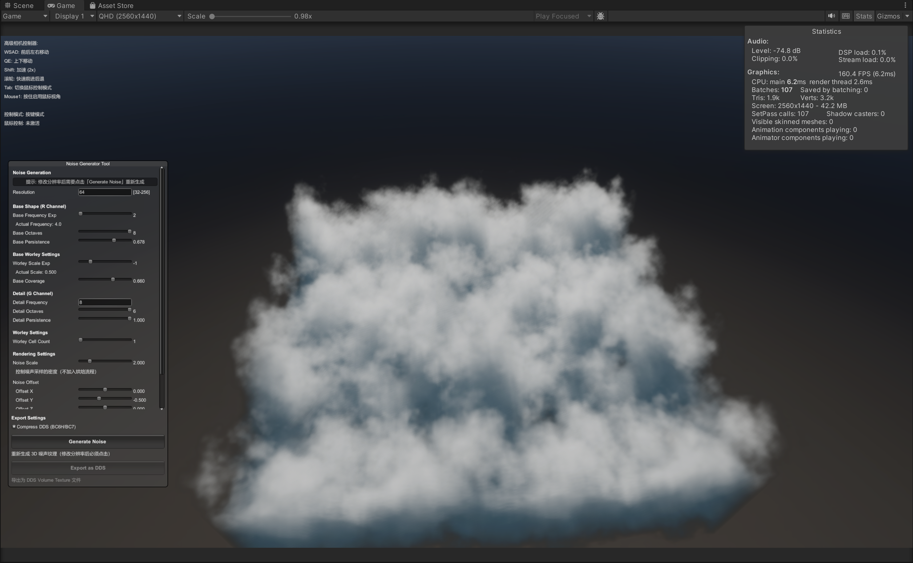

# Unity-VolumeCloudExportTools

**[English]**
A lightweight, robust Unity Editor tool for generating, previewing, and exporting 3D Noise Textures (Volume Textures) specifically designed for Volumetric Cloud rendering.

**[中文]**
一个轻量的 Unity 编辑器工具，专为体积云渲染设计，用于生成、预览和导出 3D 噪声纹理（Volume Textures）。

---

## Compatibility / 版本兼容性

* **Verified Environment (已验证环境):**
    * **Unity Version:** 2022.3.62f1
    * **Graphics API:** DirectX 11
    * **Pipeline:** HDRP (High Definition Render Pipeline)
        *(Note: Shader code is based on HDRP architecture. / 注：Shader 代码基于 HDRP 架构编写)*

* **Disclaimer (声明):**
    * This tool has currently **only** been tested on the specific version listed above.
    * Compatibility with other Unity versions (e.g., Unity 6, 2021 LTS) or other Graphics APIs (Vulkan, Metal, OpenGL) is **unknown** and not guaranteed.
    * 本工具目前**仅**在上述特定版本中进行过测试。
    * 对于其他 Unity 版本（如 Unity 6, 2021 LTS）或其他图形 API（Vulkan, Metal, OpenGL）的兼容性**未知**，暂不提供保证。

## Features / 功能特性

* **Real-time Preview:** Visualize 3D noise directly in the Unity Editor before exporting.
  * **实时预览：** 在导出前直接在编辑器中查看 3D 噪声的体积渲染效果。

* **Composite Noise Generation:**
  * **复合噪声生成：**
    * **R Channel:** Perlin-Worley noise (Base cloud shape). (R 通道：Perlin-Worley 噪声，用于云的基础形状)
    * **G Channel:** High-frequency Worley noise (Edge details). (G 通道：高频 Worley 噪声，用于边缘侵蚀细节)

* **Format Support:**
  * **多格式支持：**
    * **DDS (Volume Texture):** Supports BC6H (HDR) and BC7 compression. (支持 BC6H HDR 和 BC7 压缩格式)
    * **PNG/EXR:** Exports slices for debugging or external processing. (支持导出切片序列，便于调试或外部处理)

* **Automated Dependency Management:**
  * **全自动依赖管理：**
    * Automatically downloads Microsoft **DirectXTex** tools (`texconv`, `texassemble`) to handle professional-grade texture compression. (自动下载微软 **DirectXTex** 工具链，无需手动配置即可实现工业级纹理压缩。)

---

## Usage Workflow (Important!) / 使用流程（重要！）

1. **Open the Tool / 打开工具:**
   Go to `Tools > Noise Generator`.
   点击菜单栏 `Tools > Noise Generator`。

2. **Initialize / 初始化:**
   **Click the "Generate Noise" button first.**
   **首先点击 "Generate Noise" 按钮。**
   > *Note: Parameters are locked and export is disabled until the initial noise is generated.*
   > *注意：在生成初始噪声之前，所有参数均被锁定，且无法导出文件。*

3. **Tweak & Preview / 调整与预览:**
   Once generated, you can adjust sliders in real-time to see changes in the preview window.
   生成完毕后，你可以实时拖动滑块调整参数，并在预览窗口即时查看体积云的变化。

4. **Export / 导出:**
   Click **"Export as DDS"** to generate the final `.dds` volume texture.
   点击 **"Export as DDS"** 导出最终的 `.dds` 体积纹理文件。

---

## 🎛️ Parameters Explained / 参数详解

### 1. Noise Generation (噪声生成)
* **Resolution (分辨率):**
  * The resolution of the 3D texture (e.g., 64x64x64). Higher values provide more detail but consume more memory and processing time.
  * 3D 纹理的分辨率（如 64x64x64）。数值越高细节越丰富，但显存和计算耗时也会增加。
  * *Note: Changing resolution requires clicking "Generate Noise" again.* (注意：修改分辨率后需要再次点击 "Generate Noise" 才能生效。)

### 2. Base Shape - R Channel (基础形状 - R通道)
Defines the main body and structure of the clouds.
定义云朵的主体结构。

* **Base Frequency Exp:** Controls the scale of the Perlin noise. Higher values = smaller, more frequent cloud clumps.
  * 控制 Perlin 噪声的频率（缩放）。数值越高，云朵的团块越小、越密集。
* **Base Octaves:** The number of noise layers. Higher values add more fine detail to the base shape.
  * 噪声的层级数（八度）。数值越高，基础形状的细节层次越丰富。
* **Base Persistence:** How much each octave contributes. Higher values make the surface "rougher".
  * 持续度。数值越高，高频细节的占比越大，云朵表面看起来越“粗糙”。

### 3. Base Worley Settings (基础 Worley 设置)
Modifies the Perlin noise to look more "puffy" (Cumulus-like).
用于修饰 Perlin 噪声，使其看起来更具“棉花糖”般的堆积感（积云特征）。

* **Worley Scale Exp:** The size of the Worley cells.
  * Worley 晶格的大小。
* **Base Coverage:** Controls the fill rate. Lower values make the clouds wispier; higher values make them thicker.
  * 覆盖率。数值越低，云越稀薄（絮状）；数值越高，云越厚实。

### 4. Detail - G Channel (细节 - G通道)
High-frequency noise used for eroding the edges of the cloud to create realistic wisps.
用于侵蚀云朵边缘的高频噪声，制造出真实的丝状细节。

* **Detail Frequency/Octaves/Persistence:** Same logic as above, but applied to the detail layer (Green Channel).
  * 逻辑同上，但仅作用于细节层（绿色通道）。

### 5. Rendering Settings - Preview Only (渲染设置 - 仅预览)
These settings only affect how the noise looks in the Inspector preview, **not the exported file**.
这些设置**仅影响编辑器内的预览效果**，不会改变导出的文件。

* **Noise Scale:** Adjusts the tiling of the preview material.
  * 调整预览材质的平铺缩放，用于检查纹理细节。
* **Noise Offset:** Scrolls the noise to check continuity (seamless tiling).
  * 滚动噪声位置，用于检查纹理是否无缝衔接。

### 6. Export Settings (导出设置)
* **Compress DDS (BC6H/BC7):**
  * **Checked (勾选):** Uses `texconv` to compress the texture (Recommended for runtime). **BC6H** is used for HDR/High precision, **BC7** for standard usage.
    * 使用 `texconv` 进行压缩（推荐用于运行时）。**BC6H** 适用于 HDR 高精度需求，**BC7** 适用于标准需求。
  * **Unchecked (未勾选):** Exports uncompressed RGBA32 volume texture (Large file size).
    * 导出未压缩的 RGBA32 体积纹理。

---

## Dependencies / 依赖说明

This tool relies on **Microsoft DirectXTex** for DDS processing.
本工具依赖 **Microsoft DirectXTex** 进行 DDS 处理。

* You **do not** need to download them manually.
  * 你**无需**手动下载这些工具。
* The script will automatically detect missing tools and download `texconv.exe` and `texassemble.exe` to your project's `Library/ToolCache/` folder upon first use.
  * 脚本会在首次运行时自动检测，并自动将 `texconv.exe` 和 `texassemble.exe` 下载到你项目的 `Library/ToolCache/` 目录中。

---

## License / 许可

This project is licensed under the **MIT License**.
本项目采用 **MIT 许可证**。

* **Third Party Notices (第三方声明):**
  * This tool automatically downloads binaries from [Microsoft DirectXTex](https://github.com/microsoft/DirectXTex), which is also licensed under the MIT License.
  * 本工具自动下载并使用的 **Microsoft DirectXTex** 二进制文件同样遵循 MIT 许可证。
